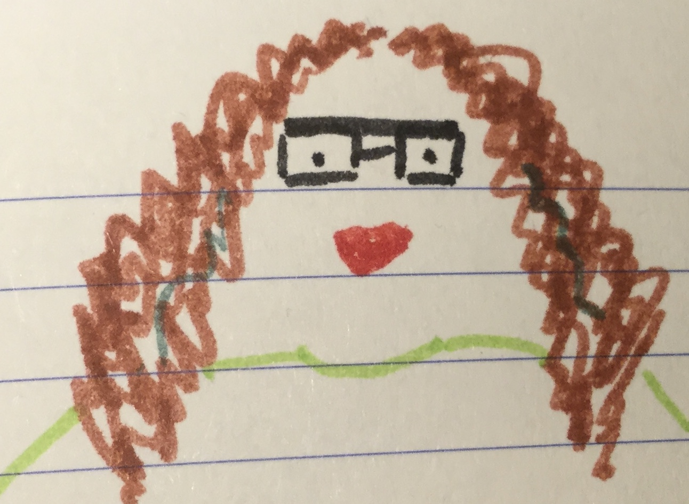

On Friday, I attended the first [Aurora programme](https://www.advance-he.ac.uk/programmes-events/aurora) day: "Identity, Impact and Voice". We were about 300 women and it seems that over 6000 have already taken this training! The event took place in the [NEC](https://www.thenec.co.uk/), Birmingham, a huge and deserted place. The day was packed with talks and exercises, from silly to deep, and a lot of discussion per tables of about 8.

The day was facilitated by [Phyllida Hancock](https://www.heacademy.ac.uk/person/phyllida-hancock), an actress with a captivating voice. We actually did some vocal exercises with her! Here there are two quotes (as literal as my note taking permits) from her:
* "Authentic performance is about congruity between what you say and your presentation."
* "Words are like rivers filling up all the space where the information needs to reach."

[Melanie Eusebe](https://www.melanieeusebe.com/) gave a moving and engaging talk with two main messages:

* Leaders are made, not born.
* I don't know what I don't know.

The first message is connected to having a **growth mindset**: embracing the journey to learn and improve, instead of any end goal. The second one, to me is connected to being open to listen to different perspectives, to explore beyond those familiar faces around, to learn, to be curious.

The day ended with a discussion about speaking up and being heard. A fellow *Auroran* proposed an idea worth implementing:
* To break the hierarchy in panels, committees, etc., introduce the people, or ask them to introduce themselves, with what they bring to the discussion, instead of titles or roles.

It was a long day and in the train back home I had the pleasure to chat with some fellow [LJMU](https://www.ljmu.ac.uk/) attendees.