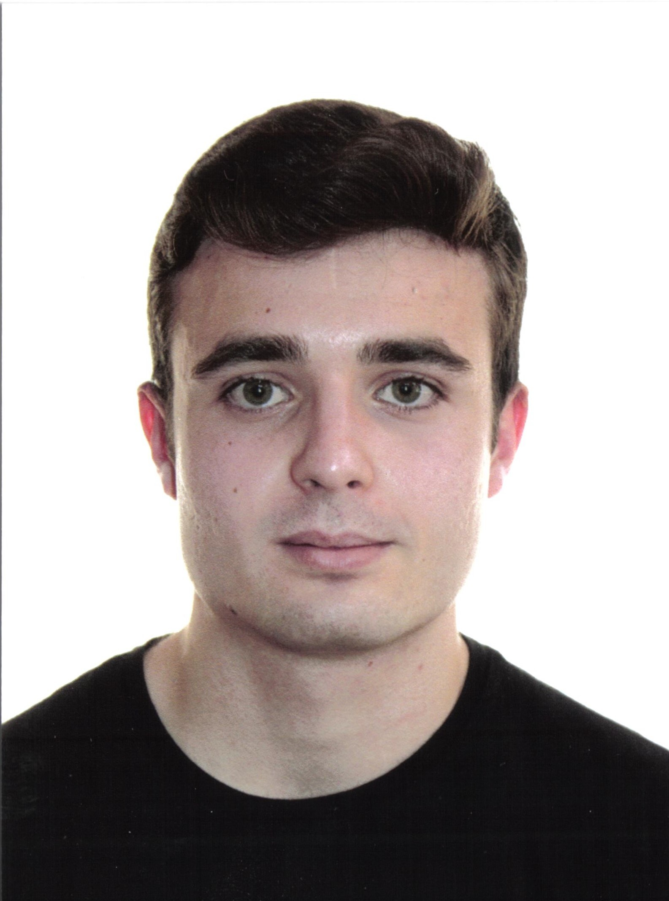

*“Illuminating the dark sector of the Universe” ATCAM project (2019-T1/TIC-12702)*

This project aims to understand the dark sector of the Universe studying the galaxies that trace it. This sector constitutes over 95% of the total energy-matter content of the Universe. Its nature remains unknown, despite decades of continuous effort. In the next years cosmological galaxy surveys will focus on the characterisation of the dark sector of the Universe. This observational characterisation relies on having an improved understanding of galaxies as cosmological tracers. We urgently need to answer the following questions:

* How can theoretical models aid and support the interpretation of cosmological observations?
* How do galaxies trace the dark sector?
* How affected are cosmological probes by galaxy formation?
* How do galaxies trace the dark sector when different cosmologies (the global composition of the Universe) are assumed?

Answering these questions will get us closer to understanding the nature of our Universe. The theoretical development from this project will support the success of space missions, such as Euclid (to be launch in 2021), and ground telescopes, such as the LSST (to start operating in 2023). Investments of millions of euros have been made in these and other ones, such eBOSS, DESI, WFIRST, etc.

The team uses a range of theoretical approaches to answer the questions above. This research programme focuses on the epoch when the Universe was less than half its present age. We will study theoretically the types of galaxies targeted by cosmological surveys.

The publications related to this project can be read [here](https://ui.adsabs.harvard.edu/search/q=docs(library%2FYgun0COhQQe8MdUjeP9mlw)&sort=date%20desc%2C%20bibcode%20desc&p_=0).

## General objectives

1. Support cosmological surveys by: (i) providing new and improved parametrisations for halo occupation models, (ii) generating new model galaxy catalogues tailored for surveys and (iii) suggesting observables to discern between different cosmological models.
2. Establish how galaxies trace the dark sector within the standard cosmology by exploring the properties of those galaxies targeted by cosmological studies with semi-analytical and hydro-dynamical simulations.
3. Quantify the impact of galaxy formation and evolution on cosmological probes by comparing models with different assumptions about the physical processes that shape galaxies.
4. Establish how galaxies trace the dark sector beyond the standard cosmology using an adequate suite of simulations.

## The team

|  |Sujatha Ramakrishnan is a post-doctoral researcher exploring how to use dark matter haloes beyond the resolution of numerical simulations. She did her PhD under the supervision of Aseem Paranjape, at the Inter-University Center for Astronomy and Astrophysics, Pune, India. Her thesis topic was the quantification of the environment of dark matter haloes.|
|  | Bernhard Vos Ginés obtained his degree in Physics at the Universidad de La Laguna in 2019 and his Master in Theoretical physics in 2020 at the Universidad Autónoma de Madrid. During his Master he obtained a JAE Grant for 9 months supervised by Santiago Ávila, in which he investigated Large Scale Structure topics as Baryonic Acoustic Oscillations using gas. Currently he is working on topics related with computational cosmology, generating galaxy mocks adapted to eBOSS and DESI surveys using Halo Occupation Distribution models. He is part of the DESI collaboration.|
|   | Guillermo Reyes Peraza is developing his PhD thesis. He obtained his Physics degree at the Universidad de La Laguna in 2018 and his Master in Theoretical physics in 2019 at the Universidad Autónoma de Madrid. He his working on better understanding galaxies with spectral emission lines using a semi-analytical model of galaxy formation and evolution, [SAGE](https://ui.adsabs.harvard.edu/abs/2022MNRAS.510.5392K/abstract). This is in preparation to the ESA satellite [Euclid](https://sci.esa.int/web/euclid), in order to be able to develop fast galaxy catalogues.|
|   | Adrián Gutiérrez Adame is a teacher assistant at the Universidad Autónoma de Madrid while he developes his PhD in our group. He obtained his Physics degree and  Master in Theoretical physics in 2021 at the Universidad Autónoma de Madrid. He his working on developing [new numerical simulations](https://ui.adsabs.harvard.edu/abs/2022arXiv220411103A/abstract) to study primordial non-gaussianity fluctuations.|
|  |Julen Expósito is hired for a year within the program ["Yo Investigo"](https://sede.comunidad.madrid/ayudas-becas-subvenciones/programa-investigo) from Comunidad de Madrid. He is further developing the publicly available code [get_nebular_emission](https://github.com/galform/get_nebular_emission) for modelling spectral emission from both star forming and AGN regions. He did his masters at the Intituto Astrofísico de Canarias.|
|  |Marco Molina exploring Halo Occupation Distribution models for [DESI](https://www.desi.lbl.gov/) QSOs for his master thesis at the Universidad Autónoma de Madrid, where he also studied his undergraduated degree.|

### Previous members

|  |  Santiago Avila is a postdoctoral researcher working in the field of Large Scale-Structure (LSS) from both the computational and an observational point of view. His main interests are Baryonic Acoustic Oscillations (BAO), Primordial Non-Gaussianities (PNG), the impact on galaxy clustering of the connection between galaxies and dark matter and fast cosmological simulations. He is co-convener of the Dark Energy Survey LSS science working group, in charge of BAO analysis and galaxy clustering for combination with Weak Lensing. He is also an active member of Euclid, DESI and SKA, he was also member of eBOSS in the past. Currently, he is also working on creating and analysing a unique suite of simulations to understand the effect of PNG on galaxy clustering. Santiago is also very active in outreach and public communication. |
|  |Ángel Chandro studied both his Physics degree and master at the Universidad Autónoma de Madrid. He started working in the group during the summer of 2021 with a summer project and then he continued to develop his master thesis supported with a grant. He has been working on the infrastructure to be able to run semi-analytical models of galacy formation and evolution, [SHARK](https://github.com/ICRAR/shark) and [GALFORM](https://ui.adsabs.harvard.edu/abs/2020MNRAS.498.1852G/abstract), on the dark matter only simulation [UNITSIM](https://ui.adsabs.harvard.edu/abs/2019MNRAS.487...48C/abstract)|
|  | Olivia Vidal finished her Physics degree in 2022 at the Universidad Autónoma de Madrid. She developed, with a short contract, a big part of the public code [get_nebular_emission](https://github.com/galform/get_nebular_emission), This is a modular code to produce model spectral emission lines for a given input of stellar mass, metallicity and star formation rate. |
